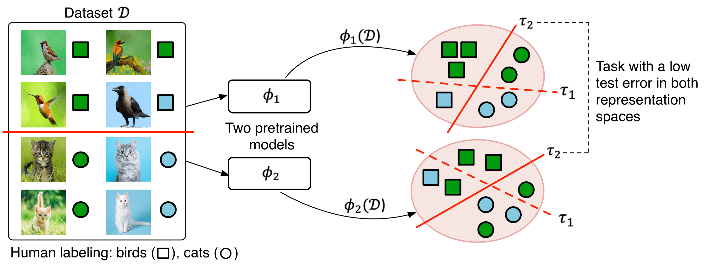

## The Pursuit of Human Labeling: A New Perspective on Unsupervised Learning

[Artyom Gadetsky](http://agadetsky.github.io), [Maria Brbić](http://brbiclab.epfl.ch)
_________________
This repo contains the source code in PyTorch of the HUME algorithm. HUME is a model-agnostic framework for inferring human labeling of a given dataset without any external supervision. For more details please check our paper The Pursuit of Human Labeling: A New Perspective on Unsupervised Learning (NeurIPS '23).

<div align="center" style="padding: 0 100pt">

</div>

### Dependencies

The code is built with the following libraries:

- [PyTorch](https://pytorch.org/) 1.13.1
- [learn2learn](http://learn2learn.net) 0.1.7
- [numpy](http://numpy.org)
- [scipy](http://scipy.org)
- [scikit-learn](http://scikit-learn.org)
- [tqdm](https://tqdm.github.io)

### Data Preparation

You can download the prepared representations that we used in our experiments by installing [gdown](https://pypi.org/project/gdown/) and running:

```
gdown 1t1EkPAbD0SBFXLyXtnlTRUt1DuvXd4fV
unzip data.zip
```

You can download the tasks found by HUME for evaluation by running:

```
gdown 1oBomawRoDws2Mo1K4Xny2O3QlqtGaiyc
unzip tasks.zip
```

You can also use your own representations and datasets. HUME is compatible with any pretrained representations. The rule of thumb is to use self-supervised representations **pretrained on the dataset of interest** as $\phi_1$.
Do not forget to normalize the representations $\phi_1$ to have unit norm (see Section 2.2 in the paper for the details). As the second representation space $\phi_2$ you can use any large pretrained model suitable for your dataset.

### Training

To check the available hyperparameters you can run:
```
python hume.py --help
```
The default hyperparameters are set to correspond to the hyperparameters used on the STL-10, CIFAR-10 and CIFAR-100-20 datasets.

For example, to run HUME on CIFAR-10 in **inductive setting** with MOCOv2 self-supervised representations and DINOv2 pretrained representations, run:
```
python hume.py \
--phi1_path data/representations/mocov2/cifar10train_l2.npy \
--phi2_path data/representations/dino/cifar10train.npy \
--gt_labels_path data/labels/cifar10train_targets.npy \
--exp_path tasks/inductive/moco_dino/cifar10/ \
--k 10 \
--seed 42 # Choose random seed
```
For STL-10 and CIFAR-100-20 just change paths accordingly and set `--k` to the corresponding number of classes.

Similarly, to run the same experiment in **transductive setting**, run:
```
python hume.py \
--phi1_path data/representations/mocov2/cifar10traintest_l2.npy \
--phi2_path data/representations/dino/cifar10traintest.npy \
--gt_labels_path data/labels/cifar10traintest_targets.npy \
--exp_path tasks/transductive/moco_dino/cifar10/ \
--k 10 \
--seed 42 # Choose random seed
```

To run HUME on ImageNet-1000 in inductive setting with MOCOv2 self-supervised representations and DINOv2 pretrained representations, run:
```
python hume.py \
--phi1_path data/representations/mocov2/imagenet1000train_l2.npy \
--phi1_path_val data/representations/mocov2/imagenet1000test_l2.npy \
--phi2_path data/representations/dino/imagenet1000train.npy \
--phi2_path_val data/representations/dino/imagenet1000test.npy \
--gt_labels_path data/labels/imagenet1000test_targets.npy \
--exp_path tasks/inductive/moco_dino/imagenet1000/ \
--k 1000 \
--outer_lr 0.1 \
--inner_lr 0.1 \
--adaptation_steps 100 \
--subset_size 20000 \
--train_fraction 0.7 \
--no_anneal \
--no_rand_init \
--seed 42 # Choose random seed
```

### Evaluation

To evaluate the obtained tasks use `evaluate.py`. For example, to evaluate 100 tasks obtained on CIFAR-10 in the inductive setting, run:
```
python evaluate.py \
--phi1_path data/representations/mocov2/cifar10test_l2.npy \
--tasks_path tasks/inductive/moco_dino/cifar10/ \
--gt_labels_path data/labels/cifar10test_targets.npy
```

### Acknowledgement

While developing HUME we greatly benefited from the open-source repositories:

- [SCAN](https://github.com/wvangansbeke/Unsupervised-Classification/tree/master)
- [SPICE](https://github.com/niuchuangnn/SPICE/tree/main)
- [Solo-learn](https://github.com/vturrisi/solo-learn/tree/main)
- [Unified SSL Benchmark](https://github.com/microsoft/Semi-supervised-learning)
- [CLIP](https://github.com/openai/CLIP/tree/main)
- [DINOv2](https://github.com/facebookresearch/dinov2/tree/main)
- [BigTransfer](https://github.com/google-research/big_transfer)
- [MoCo](https://github.com/facebookresearch/moco)

### Citing

If you find our code useful, please consider citing:

```
@inproceedings{
    gadetsky2023pursuit,
    title={The Pursuit of Human Labeling: A New Perspective on Unsupervised Learning},
    author={Gadetsky, Artyom and Brbi\'c, Maria},
    booktitle={Advances in Neural Information Processing Systems},
    year={2023},
}
```
